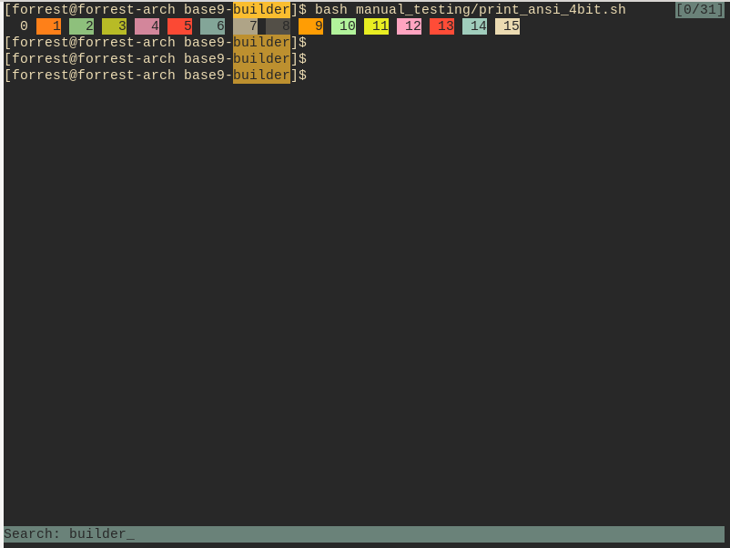

# Base9 theme for [Alacritty](https://github.com/alacritty/alacritty).

## Screenshots
<details>
<summary>View screenshots</summary>

</details>

## Installation

Make sure `~/.config/alacritty/alacritty.yml` has the following:
```yaml
import:
  - '~/.config/alacritty/base9.yml'
```


Set your Base9 palette code to shell:
```bash
BASE9_PALETTE="282828-ebdbb2-83a598-8ec07c-fe8019-fabd2f-b8bb26-d3869b-fb4934"
```

Generate theme and copy to Alacritty's config:
```bash
curl -L https://github.com/base9-theme/base9-builder/releases/download/0.1/base9-builder --output base9-builder
chmod +x base9-builder

curl -L \
https://raw.githubusercontent.com/base9-theme/base9-templates/main/templates/alacritty/default.yml.mustache \
--output base9.mustache

DESTINATION=~/.config/alacritty/base9.yml
./base9-builder render $BASE9_PALETTE base9.mustache $DESTINATION
```

Clean up:
```bash
rm base9-builder
rm base9.mustache
```


